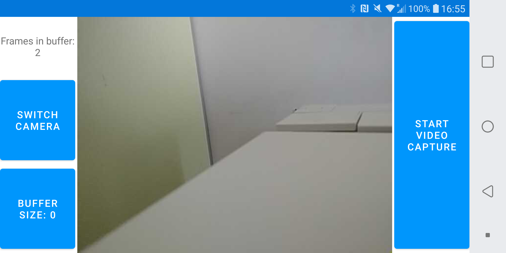
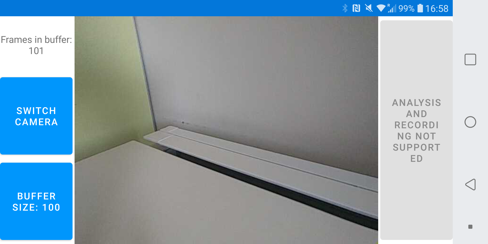
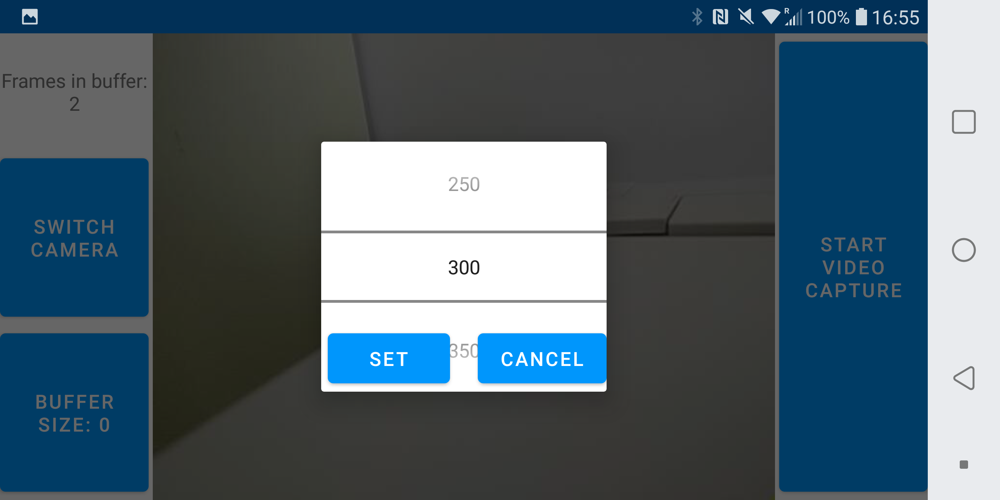

# InstantDelayedReplay
Delayed replay of camera viewfinder. Intended for visual feedback while practicing sports such as gymnastics. The app uses the CameraX api and based on the tutorial found at https://developer.android.com/codelabs/camerax-getting-started.

## UI overview
### Back camera

### Front camera

### Buffer size selector

## Example usage

